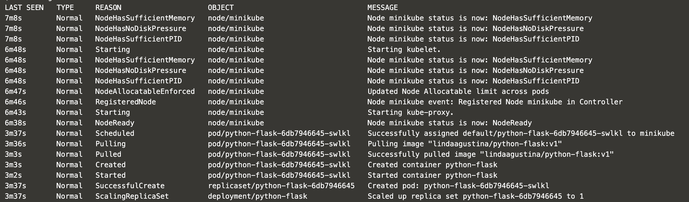
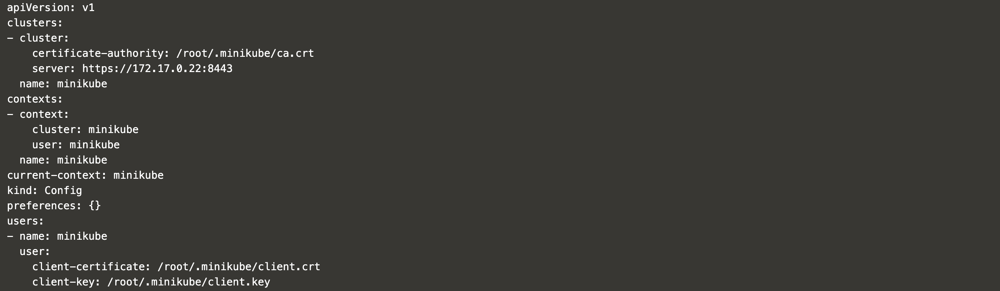
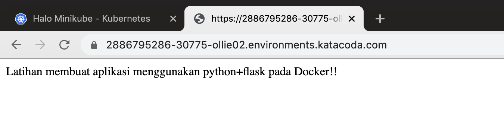

# KUBERNETES

## Membuat sebuah Deployment menggunakan Python+Flask

Pod dalam Kubernetes adalah kumpulan dari satu atau banyak Container yang saling terhubung untuk kebutuhan administrasi dan jaringan. Deployment dalam Kubernetes selalu memeriksa kesehatan Pod dan melakukan restart saat Kontainer di dalam Pod tersebut mati. Deployment digunakan untuk membuat dan mereplikasi Pod.
1. Menggunakan perintah `kubectl create` untuk membuat Deployment. Pod menjalankan Container berdasarkan image docker yang digunakan. Disini saya menggunakan image docker lindaagustina/python-flask:v1 (image ini saya buat pada pertemuan 8, yang telah saya push ke Docker Hub). Pada Deployment ini Pod hanya memiliki 1 Container saja.

`kubectl create deployment python-flask --image=lindaagustina/python-flask:v1`

Output :

`deployment.apps/python-flask created`

2. Melihat Deployment yang telah dibuat

`kubectl get deployments`

Output :

3. Melihat Pod yang telah dibuat

`kubectl get pods`

Output :

4. Melihat event yang terjadi pada cluster

`kubectl get events`

Output :

5. Melihat konfigurasi `kubectl`

`kubectl config view`

Output :

## Membuat sebuah Service

Secara default, Pod hanya bisa diakses melalui alamat IP internal di dalam cluster Kubernetes. Supaya Container python-flask bisa diakses dari luar jaringan virtual Kubernetes, saya harus ekspos Pod sebagai Service Kubernetes.

1. Ekspos Pod pada internet publik menggunakan perintah `kubectl expose` `--type-LoadBalancer` digunakan untuk ekspos Service keluar dari Cluster .

`kubectl expose deployment python-flask --type=LoadBalancer --port=5000`

Output :

`service/python-flask exposed`

2. Melihat Service yang telah dibuat

`kubectl get services`

Output :

3. Akses pada browser menggunakan port 30775 (dapat dilihat pada service).

