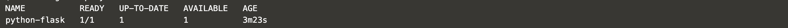

# KUBERNETES

## Komponen-Komponen Kubernetes

### Komponen Master

Komponen master menyediakan control plane bagi klaster. Komponen ini berperan dalam proses pengambilan secara global pada klaster, serta berperan dalam proses deteksi serta pemberian respons terhadap events yang berlangsung di dalam klaster. Komponen master dapat dijalankan di mesin manapun yang ada di klaster, untuk memudahkan proses yang ada, script inisiasi awal yang dijalankan biasanya memulai komponen master pada mesin yang sama, serta tidak menjalankan kontainer bagi pengguna di mesin ini.

#### kube-apiserver

Komponen di master yang mengekspos API Kubernetes. Merupakan front-end dari kontrol plane Kubernetes. Komponen ini didesain agar dapat di-scale secara horizontal.

#### etcd
Penyimpanan key value konsisten yang digunakan sebagai penyimpanan data klaster Kubernetes.

#### kube-scheduler
Komponen di master yang bertugas mengamati pod yang baru dibuat dan belum di-assign ke suatu node dan kemudian akan memilih sebuah node dimana pod baru tersebut akan dijalankan.

Faktor-faktor yang diperhatikan dalam proses ini adalah kebutuhan resource secara individual dan kolektif, konstrain perangkat keras/perangkat lunak/peraturan, spesifikasi afinitas dan non-afinitas, lokalisasi data, interferensi inter-workload dan deadlines.

#### kube-controller-manager
Komponen di master yang menjalankan kontroler.

Secara logis, setiap kontroler adalah sebuah proses yang berbeda, tetapi untuk mengurangi kompleksitas, kontroler-kontroler ini dikompilasi menjadi sebuah binary yang dijalankan sebagai satu proses. Kontroler-kontroler ini meliputi:
- Kontroler Node : Bertanggung jawab untuk mengamati dan memberikan respons apabila jumlah node berkurang.
- Kontroler Replikasi : Bertanggung jawab untuk menjaga jumlah pod agar jumlahnya sesuai dengan kebutuhan setiap objek kontroler replikasi yang ada di sistem.
- Kontroler Endpoints : Menginisiasi objek Endpoints (yang merupakan gabungan Pods dan Services).
- Kontroler Service Account & Token: Membuat akun dan akses token API standar untuk setiap namespaces yang dibuat.

## Membuat sebuah Deployment menggunakan Python+Flask

Pod dalam Kubernetes adalah kumpulan dari satu atau banyak Container yang saling terhubung untuk kebutuhan administrasi dan jaringan. Deployment dalam Kubernetes selalu memeriksa kesehatan Pod dan melakukan restart saat Kontainer di dalam Pod tersebut mati. Deployment digunakan untuk membuat dan mereplikasi Pod.
1. Menggunakan perintah `kubectl create` untuk membuat Deployment. Pod menjalankan Container berdasarkan image docker yang digunakan. Disini saya menggunakan image docker lindaagustina/python-flask:v1 (image ini saya buat pada pertemuan 8, yang telah saya push ke Docker Hub). Pada Deployment ini Pod hanya memiliki 1 Container saja.\
`kubectl create deployment python-flask --image=lindaagustina/python-flask:v1`\
Output :\
`deployment.apps/python-flask created`

2. Melihat Deployment yang telah dibuat\
`kubectl get deployments`\
Output :\

3. Melihat Pod yang telah dibuat\
`kubectl get pods`\
Output :\

4. Melihat event yang terjadi pada cluster\
`kubectl get events`\
Output :\

5. Melihat konfigurasi `kubectl`\
`kubectl config view`\
Output :\

## Membuat sebuah Service

Secara default, Pod hanya bisa diakses melalui alamat IP internal di dalam cluster Kubernetes. Supaya Container python-flask bisa diakses dari luar jaringan virtual Kubernetes, saya harus ekspos Pod sebagai Service Kubernetes.

1. Ekspos Pod pada internet publik menggunakan perintah `kubectl expose` `--type-LoadBalancer` digunakan untuk ekspos Service keluar dari Cluster.\
`kubectl expose deployment python-flask --type=LoadBalancer --port=5000`\
Output :\
`service/python-flask exposed`

2. Melihat Service yang telah dibuat\
`kubectl get services`\
Output :\

3. Akses pada browser menggunakan port 30775 (dapat dilihat pada service).\

